# Pesquisa-Cognitiva-Azure

Neste README explicarei um caso de uso da Ferramenta de Pesquisa Cognitiva dentro da Plataforma de __AI Services__ do __Microsoft Azure__. 

## Documentação

Colocarei logo no ínicio o link da documentação que foi utlizada para este laboratório de aprendizado. 

-[Microsoft Azure Machine Learn - Azure AI Search](https://microsoftlearning.github.io/mslearn-ai-fundamentals/Instructions/Labs/11-ai-search.html)

## Estudo de Caso

Neste laboratório fui solicitado a ajudar na criação de uma solução de mineração de conhecimento que facilite a busca de insights sobre as experiências dos clientes para uma rede de Cafés chamada __Fourth Coffee__.

## Criando Recursos

Para começar, será necessário entrar no [Portal Azure](https://azure.microsoft.com/pt-br/)
Dentro do portal será necessários criar alguns recursos, conforme pedido na documentação.

### Recurso Azure AI Seach

O primeiro recurso criado será com a ferramenta Azure AI Seach. É importante seguir os passos da documentação para que o recurso seja criado da forma correta. O resultado será visto na __Imagem1__ abaixo:

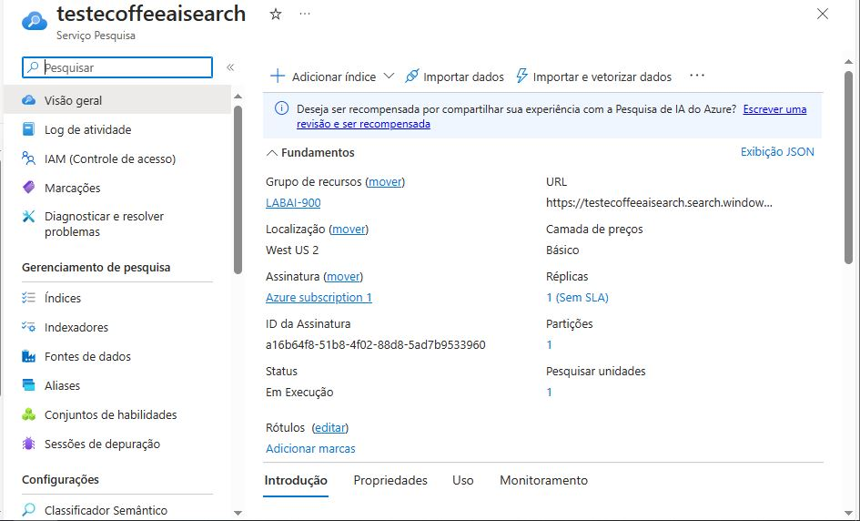Imagem1


### Recurso Azure Ai Service - Serviços Cognitivos

O segundo passo é retornar à página inicial do Azure e clicar em __"+ Criar um recurso"__ e buscar por __"Serviços Cognitivos"__ ou __"Azure AI Services"__, clicando em __"Criar"__. Aqui também é importante seguir os passos da documentação para que o recurso seja criado da forma correta. O resultado será visto na __Imagem2__ abaixo:

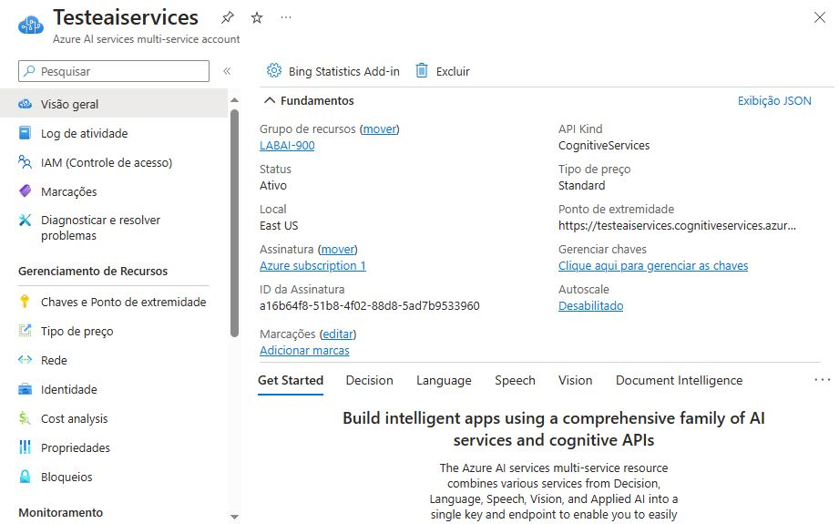Imagem2


### Recurso Storage Account - Conta de Armazenamento

O terceiro passo é retornar à página inicial do Azure e clicar em __"+ Criar um recurso"__ e buscar por __"Conta de Armazenamento"__ ou __"Storage Account"__, clicando em __"Criar"__. Como ocorreu nos outros recusrsos, aqui também é importante seguir os passos da documentação para que o recurso seja criado da forma correta. O resultado será visto na __Imagem3__ abaixo:

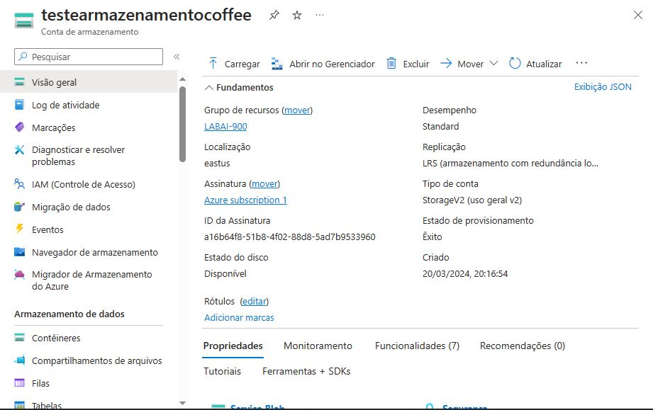Imagem3


## Upload de Documentos do Azure Storage

Aqui será realizado os passos para criação de um novo __"Container"__ aonde será armazenados os dados. Aqui é importantíssimo seguir a documentação para que seja criado da forma certa. Outro detalhe importante é __"Permitir acesso anônimo de Blob"__ como __"Habilitado"__, conforme __Imagem4__ abaixo:

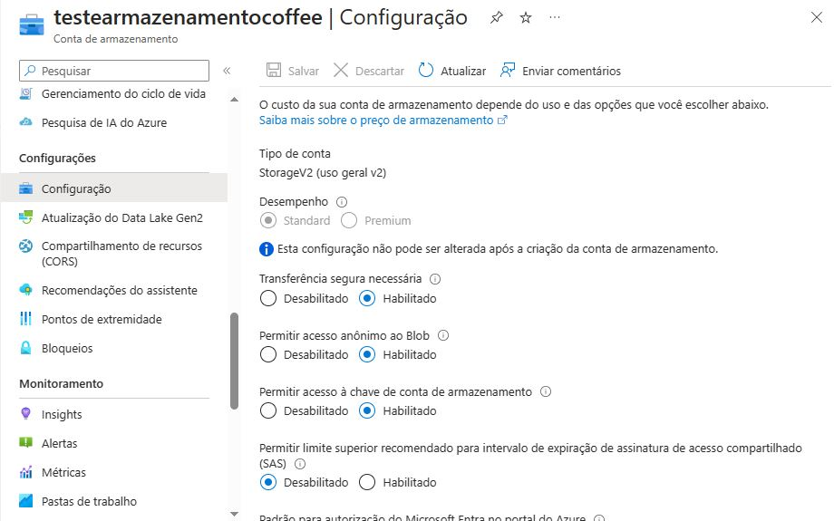Imagem4


 Após criado o Container é necessário baixar os arquivo no [Zipped Coffee Reviews](https://aka.ms/mslearn-coffee-reviews). Com os arquivos baixados é só realizar o Upload no Container criado, com o resultado igual a __Imagem6__ abaixo:

 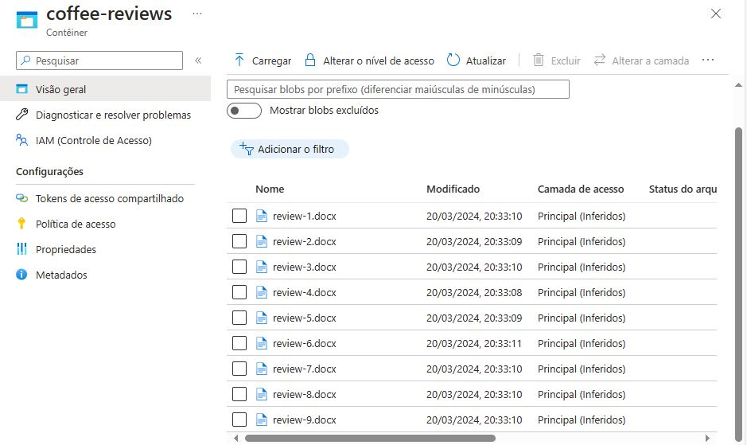Imagem6

 ## Indexar os Documentos

Depois de armazenar os documentos, usaremos o __Azure AI Search__ para extrair os insights dos documentos. O portal do Azure fornece um assistente de importação de dados. Com este assistente, criaremos um índice e um indexador para fontes de dados.

Aqui também é de suma importância seguir os passos da documentação para que o índice e o indexador seja crado da forma correta.

Após o Indexador criado, volte à página de recursos do __Azure AI Search__. No painel esquerdo, em __"Gerenciamento de Pesquisa"__, selecione __"Indexadores"__ . Selecione o __"coffee-indexer"__ recém criado.

Selecionando o indexador poderemos ver mais detalhes, conforme __Imagem7__ abaixo:

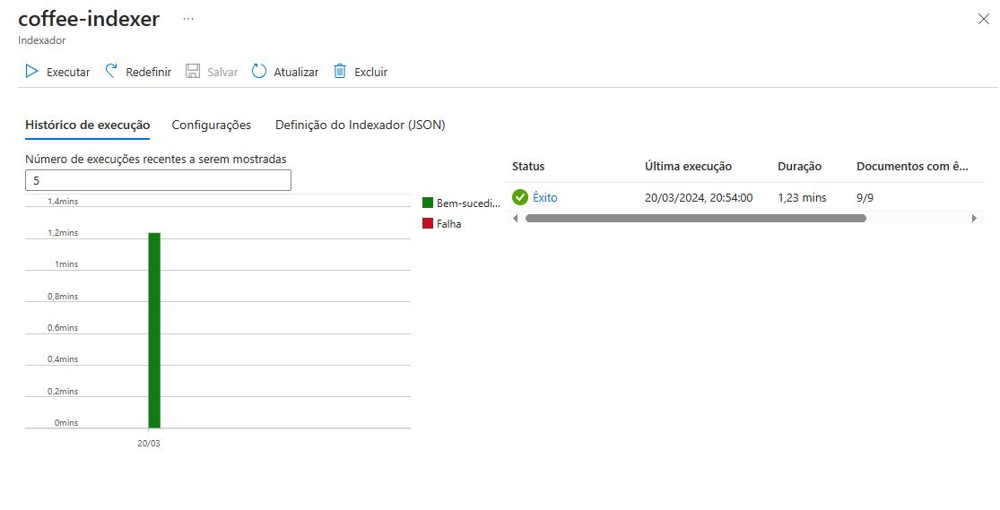Imagem7


## Realizando Consultas

Podemos usar o __"Search Explorer"__ ou __"Explorador de Pesquisas"__ para escrever consultas e revisar resultados em JSON.

### Filtrando Documentos

```
{
    "search": "*",
    "count": true
}
```

Conforme comando acima, é pedido uma pesquisa que retorna todos os documentos no índice de pesquisa, incluindo uma contagem de todos os documentos no campo __@odata.count__.
O resultado é exbido na __Imagem8__ abaixo:

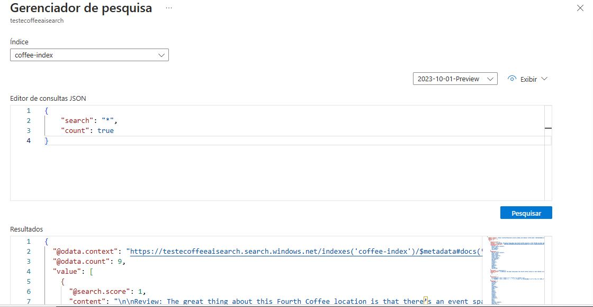Imagem8


### Filtrando Localização

```
{
 "search": "locations:'Chicago'",
 "count": true
}
```

Conforme comando acima, é pedido uma pesquisa que retorna todos os documentos no índice e filtra revisões com localização em Chicago. O resultado é __3__ no campo __@odata.count__, conforme __Imagem9__ abaixo:

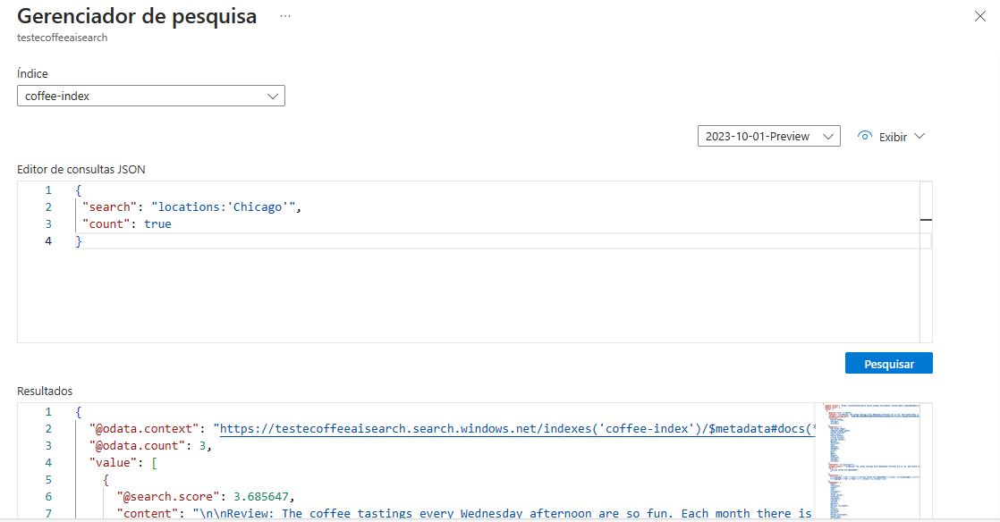Imagem9


### Filtrando Sentimentos

```
{
 "search": "sentiment:'negative'",
 "count": true
}
```

Conforme comando acima, a consulta pesquisa todos os documentos no índice e filtra revisões com sentimento negativo. O resultado é __1__ no campo __@odata.count__, conforme mostrado na __Imagem10__ abaixo:

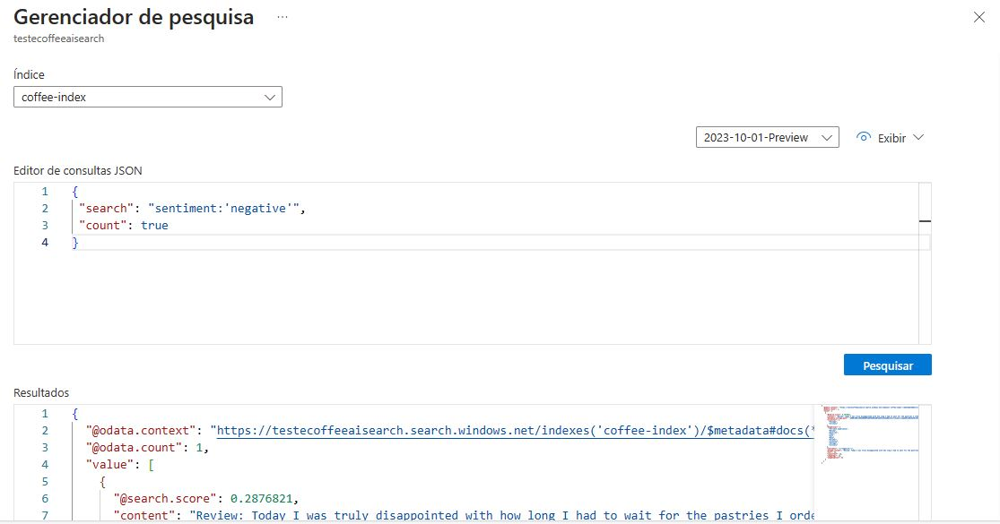Imagem10


### Armazenamento de Conhecimento

Ao importarmos os dados também foi criado o Armazenamento de Conhecimento.
Na __"Conta de Armazenamento"__, que criamos acima, selecionamos __"Container"__ e depois o item __"armazenamento-de-conhecimento"__. Na __Imagem11__ abaixo podemos ver o container aberto.

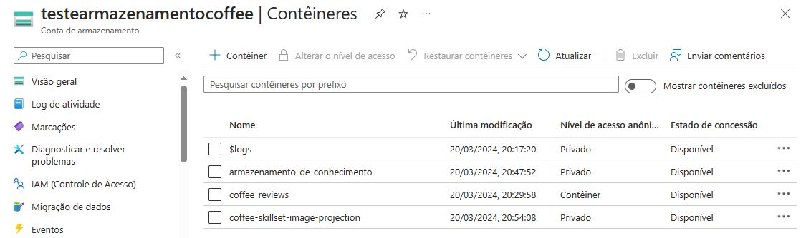Imagem11


Dentro do Armazenamento de Conhecimento selecionamos qualquer um dos itens e clicamos em __"objectprojection.json"__. Selecione __"Editar"__ para ver o JSON produzido. Um exemplo de resultado é exibido na __Imagem12__ abaixo:

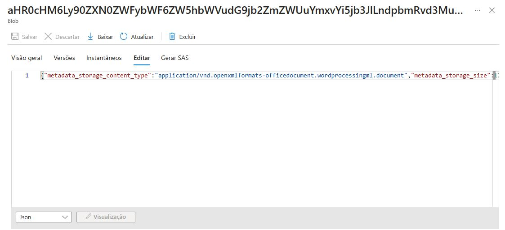Imagem12


Voltando para __"Conta de Armazenamento"__, agora selecionaremos o item __"coffee-skillset-image-projection"__. Selecione qualquer um dos arquivos __".jpg"__ . Selecione __"Editar"__ para ver a imagem armazenada no documento. Observe como todas as imagens dos documentos são armazenadas desta forma conforme __Imagem13__ abaixo. Por questões de direitos autorais resolvi não postar a imagem que contem a foto, mas seguindo o passo a passo da documentação você chegará aos mesmos resultados.

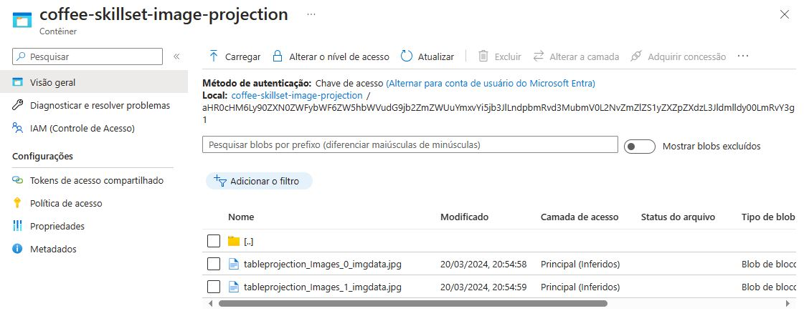Imagem13


Por último voltaremos para __"Navegador de Armazenamento"__ e clicamos em __"Tabelas"__. Dentro de __"Tabelas"__ selecionamos a tabela __"coffeeSkillsetKeyPhrases"__. Observe as __"key phrases"__ que o armazenamento de conhecimento conseguiu capturar do conteúdo das avaliações. Muitos dos campos são chaves, portanto você pode vincular as tabelas como um banco de dados relacional. O último campo mostra as __"key phrases"__ que foram extraídas pelo conjunto de habilidades. A __Imagem14__ abaixo mostra a tabela __"coffeeSkillsetKeyPhrases"__ selecionada.

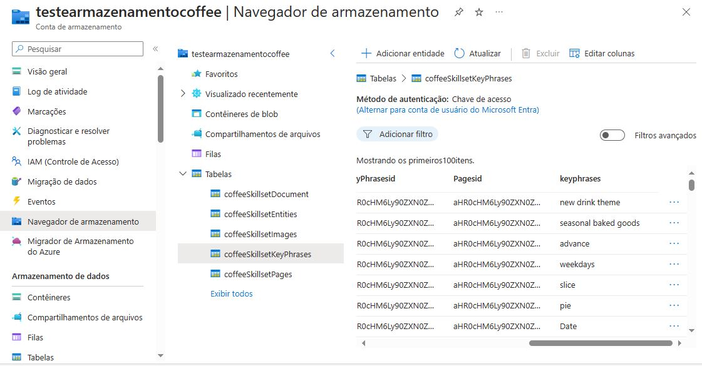Imagem14


## Insights

O serviço de AI do __Microsoft Azure__ para análise e pesquisa cognitiva pode ser muito útil para empresas identificarem as experiências. Com esta ferramenta podemos extrair dados de uma fonte de dados, enriquecer os dados com habilidades treinadas de __IA__, entre outros, com isso gerando __Insights__ que podem ser utilizados para tomadas de decisões como melhorias nos produtos ou serviços e mudanças em campanhas de Marketing.

## Conclusão

Este foi o Laboratório mais desafiador para mim até agora, pois tive que lidar com várias configurações e vários recursos que estão conectados, mas fiquei muito feliz com o resultado deste Laboratório. Creio que estas ferramentas abordadas já estão sendo utilizadas e serão ainda mais utilizadas no futuro para optenção de dados que podem ajudar na tomada de decisão das empresas.

## Referências

- [Microsoft Azure](https://azure.microsoft.com)

- [AI Services-Language](https://azure.microsoft.com/pt-br/products/ai-services/ai-language/)

## Documentação

-[Microsoft Azure Machine Learn - Azure AI Search](https://microsoftlearning.github.io/mslearn-ai-fundamentals/Instructions/Labs/11-ai-search.html)

## Ferramentas e Serviços

- 

- 

- 